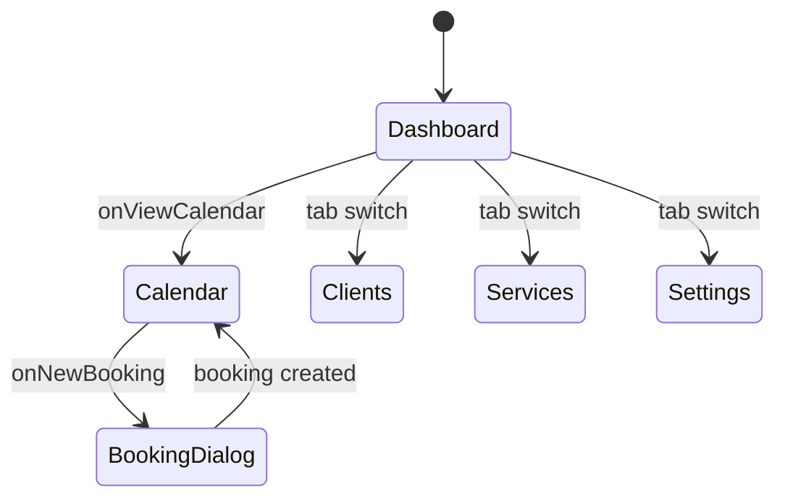
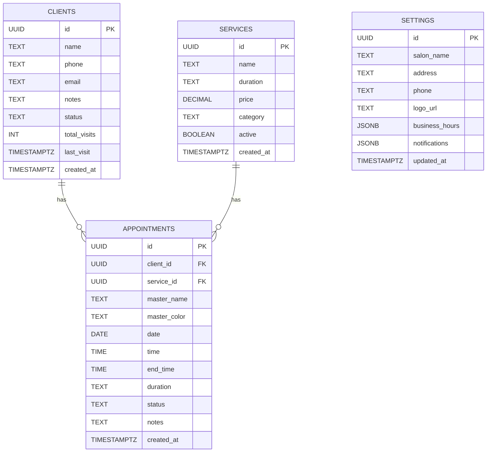

# Архитектура проекта SaaS-CRM-Dashboard (BeautyFlow)

> Последнее обновление: 2026-01-16

## Технологический стек

| Слой              | Технология                                      |
| ----------------- | ----------------------------------------------- |
| **Framework**     | Next.js 16.x (App Router, `"use client"`)       |
| **Язык**          | TypeScript 5.x                                  |
| **UI библиотека** | Radix UI + shadcn/ui                            |
| **Стилизация**    | Tailwind CSS 4.x с Custom CSS Variables         |
| **Анимации**      | Framer Motion 12.x                              |
| **Графики**       | Recharts 2.x                                    |
| **Backend/DB**    | Supabase (PostgreSQL + REST API)                |
| **Уведомления**   | Sonner (react-toast)                            |
| **Формы**         | react-hook-form + Zod                           |
| **Деплой**        | Vercel (предполагается по структуре проекта)    |

---

## Структура директорий

```
Antigravity_Project_2/
├── .agent/                  # Правила и workflows для AI агента
│   └── rules/               # Markdown-правила (senior-dev, git-policy и др.)
├── app/
│   ├── globals.css          # Глобальные стили, CSS переменные темы
│   ├── layout.tsx           # RootLayout с ThemeProvider
│   └── page.tsx             # Главная SPA-страница с состоянием навигации
├── components/
│   ├── dialogs/             # Модальные окна и Sheet-ы
│   │   ├── add-client-sheet.tsx      # [Deprecated?] Дублируется client-sheet
│   │   ├── client-sheet.tsx          # Добавление/редактирование клиента
│   │   ├── edit-service-dialog.tsx   # Редактирование услуги
│   │   └── new-booking-dialog.tsx    # Wizard создания записи (3 шага)
│   ├── views/               # Основные экраны (Single Page с tabbing)
│   │   ├── calendar-view.tsx         # Календарь записей
│   │   ├── clients-view.tsx          # Список клиентов
│   │   ├── dashboard-view.tsx        # Аналитика (mock-данные)
│   │   ├── services-view.tsx         # Услуги по категориям
│   │   └── settings-view.tsx         # Настройки бизнеса
│   ├── ui/                  # shadcn/ui компоненты (~55 файлов)
│   ├── appointment-list.tsx # Компонент списка записей (не используется?)
│   ├── bottom-nav.tsx       # Нижняя навигация (табы)
│   ├── kpi-cards.tsx        # KPI карточки (не используется?)
│   ├── mobile-header.tsx    # Шапка с логотипом, поиском, уведомлениями
│   └── theme-provider.tsx   # Обёртка next-themes
├── hooks/
│   ├── use-mobile.ts        # Хук определения мобильного viewport
│   └── use-toast.ts         # Хук для тостов (shadcn)
├── lib/
│   ├── db.ts                # CRUD функции для Supabase (clients, services, appointments, settings)
│   ├── supabase.ts          # Инициализация Supabase клиента
│   └── utils.ts             # Утилита cn() для className
├── public/                  # Статические файлы и иконки
├── supabase/
│   └── schema.sql           # DDL таблиц БД + примеры данных
├── types/
│   └── database.ts          # TypeScript интерфейсы для таблиц Supabase
├── DEV_LOG.md               # Журнал разработки
├── package.json             # npm зависимости и скрипты
└── tsconfig.json            # Конфигурация TypeScript
```

---

## Ключевые архитектурные решения

### 1. Навигация (SPA)
- Используется **единственная страница** `app/page.tsx` с локальным состоянием `activeTab`.
- Компонент `BottomNav` переключает табы внутри страницы.
- **Проблема:** Нет deep linking (URL не меняется при переключении табов).

### 2. Глобальный State
- Нет централизованного state-менеджера (Zustand, Redux).
- Состояние записей `appointments` живёт в `page.tsx` и прокидывается в `CalendarView`.
- Клиенты, услуги загружаются **локально** в каждом view.

### 3. Состояние даты (Дублирование)
- `CalendarView` — `currentDate` (useState)
- `MobileHeader` — `currentDate` (useState, отдельный!)
- **Проблема:** Синхронизация между ними отсутствует.

### 4. Supabase интеграция
- Все CRUD операции в `lib/db.ts`.
- Без аутентификации: RLS политики "Allow all".
- Таблицы: `clients`, `services`, `appointments`, `settings`.

### 5. Темизация
- CSS переменные в `globals.css` (`--primary`, `--background`, и т.д.).
- `ThemeProvider` от `next-themes` для light/dark.

---

## Стейт-машина UI



---

## Схема базы данных



---

## Известные технические долги

| #  | Компонент               | Описание проблемы                                                                 | Тип             |
| -- | ----------------------- | --------------------------------------------------------------------------------- | --------------- |
| 1  | `app/page.tsx`          | TODO: `clientName` и `service` берутся из неправильных полей                      | 🔴 Критично     |
| 2  | `mobile-header.tsx`     | Кнопки `ChevronLeft/Right` не имеют обработчиков, дата не синхронизирована        | 🟡 UI баг       |
| 3  | `calendar-view.tsx`     | `Week` режим отключён (`disabled={mode === "Week"}`)                              | 🟡 Не реализовано |
| 4  | `new-booking-dialog.tsx`| TODO: `end_time` не рассчитывается (ставится равным `time`)                       | 🟡 Логика       |
| 5  | `dashboard-view.tsx`    | Все данные — Mock, нет реальных запросов к Supabase                               | ⚪ Заглушка     |
| 6  | `services-view.tsx`     | Кнопка "Add Service" не имеет обработчика                                         | 🟡 Кнопка-заглушка |
| 7  | `clients-view.tsx`      | Пункт меню "View Profile" — заглушка                                              | ⚪ Заглушка     |
| 8  | `settings-view.tsx`     | Загрузка логотипа — заглушка (toast-симуляция)                                    | ⚪ Заглушка     |
| 9  | `mobile-header.tsx`     | Кнопка `Bell` (уведомления) — заглушка                                            | ⚪ Заглушка     |
| 10 | Глобально               | Нет ESLint конфига в репозитории                                                  | ⚪ Инфра        |
| 11 | Глобально               | Нет тестов (unit/e2e)                                                             | ⚪ Инфра        |
| 12 | `add-client-sheet.tsx`  | Дублирует функциональность `client-sheet.tsx` — возможный мёртвый код             | ⚪ Cleanup      |

---

## Легенда Severity

- 🔴 **Критично** — влияет на корректность данных или UX
- 🟡 **Важно** — влияет на UX или функциональность
- ⚪ **Заглушка/Инфра** — не работает, но помечено как Placeholder

---

## Следующие шаги (рекомендации)

1. **Синхронизация даты** — поднять `currentDate` в `page.tsx`, передавать в Header и CalendarView.
2. **Исправить маппинг Appointments** — добавить JOIN-запрос или загрузить справочники.
3. **Оживить Week View** — реализовать недельный режим календаря.
4. **Рассчитывать `end_time`** — парсить `duration` и добавлять к `time`.
5. **Dashboard: реальные данные** — заменить mock на запросы к Supabase.
6. **Удалить дубликат** `add-client-sheet.tsx` если он не используется.
